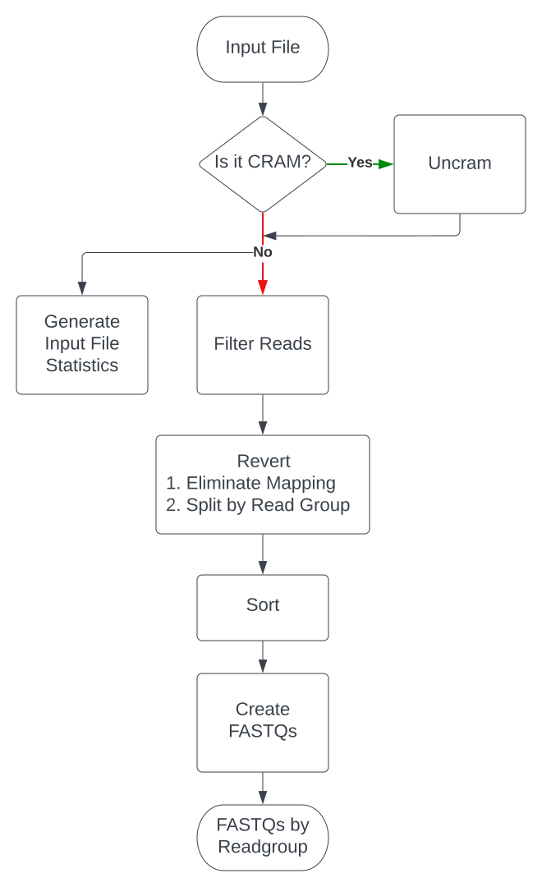

# convert-BAM2FASTQ

[](https://github.com/TheBoutrosLab/pipeline-convert-BAM2FASTQ/actions/workflows/prepare-release.yaml)

- [Overview](#overview)
- [How to Run](#how-to-run)
- [Flow Diagram](#flow-diagram)
- [Pipeline Steps](#pipeline-processes)
- [Inputs](#inputs)
- [Profiles](#profiles)
- [Outputs](#outputs)
- [Discussions](#discussions)
- [Contributors](#contributors)
- [References](#references)
- [License](#license)

## Overview

Nextflow pipeline to convert BAM or CRAM files to FASTQs. This pipeline takes as input either a BAM or CRAM file generated from alignment of DNA or RNA sequencing reads and generates FASTQs of the reads. Options are included to allow users to choose whether to keep the original quality scores (OQ) if available, to filter reads that did not pass vendor quality check or are unmapped, to generate a summary of the input file, and to output FASTQs by read groups.

## How to Run

**Requirements**: Currently supported Nextflow versions: `23.04.2`

**The pipeline is currently configured to run on a SINGLE NODE one sample per pipeline run.**

1. Update the params section of the .config file ([Example config](config/template.config)).

2. Update the YAML ([Template YAMLs](input/)) for input specification.

3. Download the submission script (submit_nextflow_pipeline.py) from [here](https://github.com/theboutroslab/tool-submit-nf), and submit your pipeline below. Alternatively run directly with `nextflow run` passing the config and YAML.

- YAML input
```
python submit_nextflow_pipeline.py \
       --nextflow_script /path/to/main.nf \
       --nextflow_config /path/to/call-recalibrate-bam.config \
       --nextflow_yaml /path/to/sample.yaml \
       --pipeline_run_name job_name \
       --partition_type <type> \
       --email email_address
```

## Flow Diagram



## Pipeline Processes
### 1. Input Validation
Checks if input files are valid.
### 2. Uncram Input file with `.cram` extension
Uses specified reference genome to decompress CRAM files and restore it to a BAM file.
### 3. Get Summary Statistics
Uses SAMtools `flagstat` and `stats` command to generate a summary with basic information on reads
### 4. Filter Failed Reads
Removes reads that have failed basic QC per the vendor specification
### 5. Eliminate Mapping Information and Output by ReadGroup
Uses PicardTools `RevertSam` command to eliminate genomic coordinates leaving only read and quality scores. This process also outputs intermediate files separated by read group.
### 6. Sort intermediate file
Uses SAMtools `collate` command to sort the intermediate files. This is needed for the FASTQ creation stage.
### 7. Create FASTQs
Uses SAMtools `fastq` to output paired FASTQs and supplementary reads.

## Inputs

### Input YAML

| Field | Type | Description |
|:------|:-----|:------------|
| `patient_id` | string | Patient ID (will be standardized according to data storage structure in the near future) |
| `path` | path | Absolute path to BAM/CRAM file |
| `id` | string | Sample identifier |

Input normal BAM:
```
---
patient_id: "patient_id"
input:
  BAM:
    normal:
      - path: "/absolute/path/to/BAM"
        id: "sample_id"
```

Input tumor CRAM:
```
---
patient_id: "patient_id"
input:
  CRAM:
    tumor:
      - path: "/absolute/path/to/CRAM"
        id: "sample_id"
```

### Config

| Input Parameter | Required | Type | Description |
|:----------------|:---------|:-----|:------------|
| `dataset_id` | Yes | string | Dataset ID |
| `portion_id` | Yes | string | Identifier of the portion if sample is split across multiple files or had top-up sequencing processed separately |
| `filter_qc_failed_reads` | Yes | boolean | Whether to filter QC failing reads when generating FASTQs |
| `split_unmapped_reads_to_separate_file` | Yes | boolean | Whether to separate out unmapped reads into separate FASTQ file |
| `save_intermediate_files` | Yes | boolean | Set to false to disable publishing of intermediate files; true otherwise; disabling option will delete intermediate files to allow for processing of large BAMs |
| `reference_fasta` | Yes | path | Absolute path to reference genome fasta file |
| `work_dir` | optional | path | Path of working directory for Nextflow. When included in the sample config file, Nextflow intermediate files and logs will be saved to this directory. Setting this directory to `/hot` or `/tmp` or directories not optimized for scratch I/O can lead to high server latency and potential disk space limitations, respectively. |
| `apptainer_library` | optional | path | Path to readable Apptainer library directory containing any existing Apptainer images. |
| `apptainer_cache` | optional | path | Path to writable Apptainer cache directory where images will be cached. |
| `singularity_library` | optional | path | Path to readable Singularity library directory containing any existing Singularity images. |
| `singularity_cache` | optional | path | Path to writable Singularity cache directory where images will be cached. |
| `base_resource_update` | optional | namespace | Namespace of parameters to update base resource allocations in the pipeline. Usage and structure are detailed in `template.config` and below. |


The below parameters have default values defined in [`default.config`](./config/default.config) and generally do not need to be set by the user.

| Optional Parameter | Type | Description |
| :------------------| :----| :-----------|
| `docker_container_registry_uclahscds` | string  | UCLAHS-CDS registry containing tool Docker images. |
| `docker_container_registry_theboutroslab` | string  | TheBoutrosLab registry containing tool Docker images. |
| `docker_image_pipeval`, `pipeval_version` | string | Docker image name and version for PipeVal. |
| `docker_image_picard`, `picard_version` | string | Docker image name and version for Picard. |
| `docker_image_samtools`, `samtools_version` | string | Docker image name and version for SAMtools. |
| `checksum_alg` | string | Type of checksum to compute for output files. |
| `checksum_extra_args` | string | Additional arguments to pass to the checksum process. |

#### Base resource allocation updaters
To update the base resource (cpus or memory) allocations for processes, use the following structure and add the necessary parts. The default allocations can be found in the [resources JSON](./config/resources.json)
```Nextflow
base_resource_update {
    memory = [
        [['process_name', 'process_name2'], <multiplier for resource>],
        [['process_name3', 'process_name4'], <different multiplier for resource>]
    ]
    cpus = [
        [['process_name', 'process_name2'], <multiplier for resource>],
        [['process_name3', 'process_name4'], <different multiplier for resource>]
    ]
}
```
> **Note** Resource updates will be applied in the order they're provided so if a process is included twice in the memory list, it will be updated twice in the order it's given.

Examples:

- To double memory of all processes:
```Nextflow
base_resource_update {
    memory = [
        [[], 2]
    ]
}
```
- To double CPUs and memory for `collate_BAM_SAMtools` and double memory for `run_validate_PipeVal`:
```Nextflow
base_resource_update {
    cpus = [
        ['collate_BAM_SAMtools', 2]
    ]
    memory = [
        [['collate_BAM_SAMtools', 'run_validate_PipeVal'], 2]
    ]
}
```

## Profiles

Profiles can be selected to control which containerization system will be used. Profile selection can be passed to the Nextflow run command using `-profile`. Available profiles:

- `docker` - Use Docker as the containerization system
- `apptainer` - Use Apptainer as the containerization system
- `singularity` - Use Singularity as the containerization system

## Outputs

| Output | Description |
| ------------ | ------------------------ |
| `<readgroup_ID>_R{1,2}.fastq.gz` | pair of FASTQ files |
| `<readgroup_ID>_singleton.fastq.gz` | FASTQ with singleton reads |

## Discussions

- [Issue tracker](https://github.com/theboutroslab/pipeline-convert-BAM2FASTQ/issues) to report errors and enhancement ideas.
- Discussions can take place in [convert-BAM2FASTQ Discussions](https://github.com/theboutroslab/pipeline-convert-BAM2FASTQ/discussions)
- [convert-BAM2FASTQ pull requests](https://github.com/theboutroslab/pipeline-convert-BAM2FASTQ/pulls) are also open for discussion

## Contributors

Please see list of [Contributors](https://github.com/theboutroslab/pipeline-convert-BAM2FASTQ/graphs/contributors) at GitHub.

## References

1. SAMtools http://www.htslib.org/
2. Picard https://broadinstitute.github.io/picard/

## License

Author: Yash Patel

pipeline-convert-BAM2FASTQ is licensed under the GNU General Public License version 2. See the file LICENSE.md for the terms of the GNU GPL license.

pipeline-convert-BAM2FASTQ extracts reads from BAM or CRAM files into FASTQ files.

Copyright (C) 2026 Sanford Burnham Prebys Medical Discovery Institute ("Boutros Lab")

This program is free software; you can redistribute it and/or modify it under the terms of the GNU General Public License as published by the Free Software Foundation; either version 2 of the License, or (at your option) any later version.

This program is distributed in the hope that it will be useful, but WITHOUT ANY WARRANTY; without even the implied warranty of MERCHANTABILITY or FITNESS FOR A PARTICULAR PURPOSE. See the GNU General Public License for more details.
